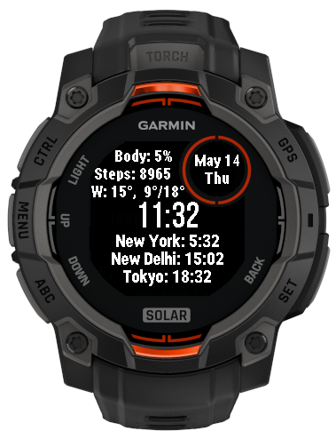

# Description
Watchface with 3 time zones by choice of user for Garmin Instinct 3 Solar. To configure timezone, user should set coordinates of the place (latitude, longtitude, degrees in numeric format like 10.10, -20.20) and set name using Garmin Connect app.

# Supported models:
- Instinct 2
- Instinct 2s
- Instinct 2x
- Instinct 3 45/50 / Instinct e45
- Instinct e40
- Instinct e45

# Known issues:
Mumbai time zone is wrong for some reason, but New Delhi is fine (+5:30 UTC).

# Plans
- Add support for smaller version of Instinct (40mm)
- Add configuration of fields (show device battery / body battery)
